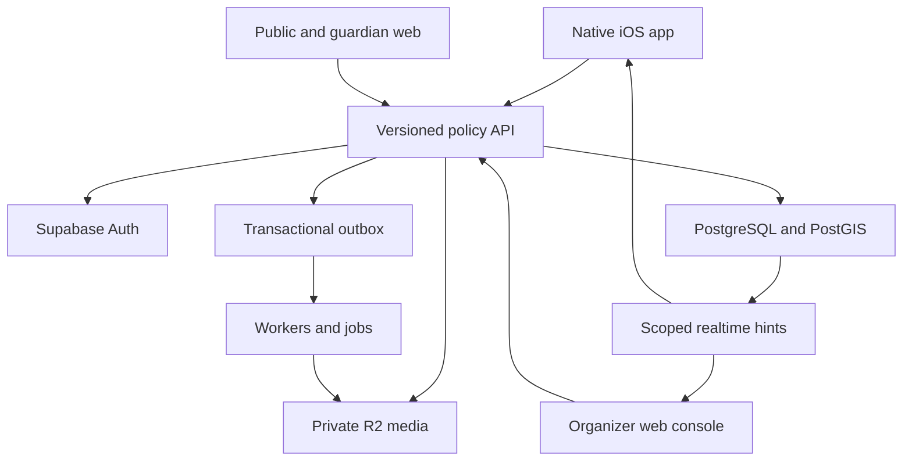

# Day of Service architecture

Status: architecture baseline for implementation  
Last reviewed: 2026-08-16  
Repository baseline: `main` at `1c2a95286d2d4692b3ebdf47247b0bac0ff44a87`

## Authority and scope

This document describes the system that is implemented today and the target
boundaries for the v1 product. It is a living implementation guide, not a
replacement for product decisions.

When artifacts disagree, use this order:

1. `documents/02-decision-log.md` is authoritative.
2. Approved ADRs explain how a decision is implemented. An ADR cannot silently
   reverse the decision log.
3. Versioned files under `contracts/` define the interface that clients and
   servers must implement.
4. This document defines module ownership and dependency direction.
5. Code and previews demonstrate current behavior but do not override the
   preceding sources.

A change to D-001 through D-014 requires owner approval and an ADR covering
migration, privacy, security, tests, rollout, and rollback.

## Current-state assessment

The repository is an early, preview-backed iOS prototype. It proves several
domain rules, but it is not a deployable or production-secure implementation.

### Implemented

- A Swift 6 package, targeting iOS 17, builds the non-UI `DOSCore` module.
- Swift domain types cover organizations, occurrences, sites, registrations,
  attendance commands, role context, assignment planning, media state, and
  expiring Safety Sharing.
- Unit tests exercise registration validation, tenant/site-scoped role checks,
  hard capacity planning, media transitions, Safety Sharing expiry, unknown
  enum handling, and offline attendance deduplication.
- A small SwiftUI preview flow demonstrates event discovery, detail,
  registration, confirmation, and basic loading/error/empty states.
- `APIClient` establishes an HTTP adapter seam and applies ISO-8601 coding,
  idempotency headers, and coarse status mapping.
- `OfflineAttendanceQueue` establishes an operation-ID-based reconciliation
  seam with caller-supplied persistence.

### Not implemented

- There is no committed Xcode project, app target configuration, asset catalog,
  signing setup, UI test target, or continuous integration workflow.
- The shipping app still defaults to `PreviewEventService`; it has no production
  composition root, environment selection, authentication, token refresh, or
  deep-link handling.
- Supabase Auth, PostgreSQL/PostGIS migrations, constraints, RLS policies,
  Edge Functions, realtime authorization, and audit/outbox infrastructure do
  not exist.
- Public/guardian web flows and the organizer console do not exist.
- Cloudflare R2 buckets, signed uploads, processing, moderation, derivative
  publication, and takedown invalidation do not exist.
- Offline persistence is not encrypted or durable. Notifications,
  observability, exports, retention, deletion, and operational runbooks do not
  exist.
- Existing tests are useful unit examples, not evidence for cross-tenant
  isolation, concurrency, contract compatibility, accessibility, or release
  readiness.

### Prototype constraints that must not become production rules

- `AuthorizationContext` is a client-side helper only. Server authorization and
  RLS are the security boundary. Its current `.register` behavior also models
  organizer permission rather than the adult/guardian registration capability
  in `documents/03-roles-and-permissions.md`.
- `RegistrationRequest.participantNames` and `acceptedDocumentIDs` are preview
  shortcuts. Production registration refers to server-owned participant IDs;
  valid, attributable consent evidence is verified by the server.
- `RegistrationValidator` checks whether a submitted group alone exceeds a
  site's limit. Only an atomic server transaction can enforce remaining hard
  capacity under concurrency.
- `AssignmentAllocator` is a deterministic planning primitive, not an
  authorization, eligibility, consent, or transaction boundary.
- `PreviewEventService.waiverID` and other fixed preview identifiers must never
  escape preview/test builds.
- `APIClient` currently lacks bearer authentication, cursor pagination,
  structured errors, request IDs, optimistic versions, retry policy, and
  cancellation-aware instrumentation.
- The single linear `MediaAsset.state` implies moderator approval before any
  audience can see an upload. Production uses separate processing, event-feed,
  report/quarantine, and anonymous-publication state; see ADR-004.

## Architectural style

V1 is a modular monolith with three user-facing clients and managed platform
services. The modular monolith keeps policy and transactions together while the
product and team are young; module boundaries allow later extraction without
introducing distributed transactions now.



The versioned API is implemented with narrowly scoped Supabase Edge Functions
and database functions where an atomic transaction is required. Realtime is a
cache-invalidation and responsiveness mechanism, never the system of record.

The responsive web product is one TypeScript application with public,
guardian, and authenticated organizer route groups. One application avoids
duplicating identity, accessibility, design-system, and contract work. Browser
code holds publishable configuration only and calls the same `/v1` policy API
as iOS.

See:

- `docs/adr/ADR-002-modular-monolith-system-shape.md`
- `docs/adr/ADR-003-authorization-and-data-exposure.md`
- `docs/adr/ADR-004-reactive-event-feed-media.md`
- `documents/adr/ADR-001-v1-contract-boundary.md` when that proposed contract
  ADR is integrated

## Bounded contexts and ownership

| Context | Owns | Does not own |
|---|---|---|
| Identity and tenancy | profiles, organizations, memberships, invitations, role and support grants | Event privileges inferred from client state |
| Event programming | reusable event definitions, occurrences, sites, shifts, tasks, publish transitions | Registration, attendance, or public location policy |
| Participation | households, dependents, teams, registrations, eligibility, capacity, assignments, waitlists | Legal-document authoring or attendance facts |
| Consent | versioned legal documents and append-only attributable evidence | Mutable acceptance flags on a profile or registration |
| Event operations | scoped rosters, attendance events, tasks, announcements, incidents | General tenant administration or public incident data |
| Safety Sharing | short-lived purpose-bound shares and recipient scope | Background movement history or registration eligibility |
| Media | upload authorization, object metadata, scanning, derivatives, event-feed visibility, optional public-gallery publication, reports, quarantine, takedown | Public access to originals or storage keys |
| Impact and lifecycle | aggregate reporting, exports, access/deletion requests, retention jobs | Unthresholded minor or incident analytics |
| Platform operations | redacted telemetry, immutable audit, break-glass support, feature flags | Routine access to tenant content |

Each context owns its state transitions. Another context uses an application
service or versioned contract rather than updating the owner's tables directly.
Cross-context effects are committed with an outbox record and processed
idempotently.

## Repository and module boundaries

The initial structure should evolve in place; do not perform a repository-wide
move while foundation work is parallelized.

```text
DOS/                       Native application source
  App/                     composition, navigation, environment, deep links
  Core/                    contract-neutral primitives and shared support
  Domain/                  value types and pure business rules
  Features/                feature UI and feature-specific application state
  Infrastructure/          API, auth, persistence, notifications, telemetry
DOSTests/                  Swift unit and adapter tests
DOSUITests/                iOS critical-flow and accessibility tests
web/                       responsive TypeScript web application
supabase/
  migrations/              forward-only schema, functions, constraints, RLS
  functions/               versioned HTTP policy adapters
  tests/                   database, RLS, transaction, and function tests
workers/                   media, notifications, exports, retention, reconciliation
contracts/                 versioned OpenAPI, event schemas, shared fixtures
docs/                      living product, architecture, test, security, release docs
scripts/                   reproducible local and CI automation
```

This is the target ownership map, not permission to rename existing paths in a
feature PR. Foundation work may create directories as needed. Large moves need
a dedicated, green, mechanical PR.

### Native dependency direction

`Features` may depend on `Domain` and application protocols. `Infrastructure`
implements those protocols and may depend on generated contract DTOs. `App`
constructs concrete adapters. Dependencies never point from `Domain` to
SwiftUI, URLSession, Supabase, persistence, or analytics.

- Views do not issue HTTP requests or read secrets.
- Feature models are `@MainActor`; I/O adapters use structured concurrency.
- Shared mutable state is isolated by actors.
- Domain values are `Sendable` and deterministic where practical.
- Transport DTOs are mapped to domain types at the infrastructure boundary;
  API field names do not leak through the UI.
- Preview/test adapters are selected explicitly by build configuration or
  dependency injection. Production must fail closed if required configuration
  is missing; it must not silently use preview data.

### Web dependency direction

- Use strict TypeScript and a single generated or hand-validated v1 contract
  client.
- Route components depend on feature services, not Supabase tables or R2.
- Runtime schema validation protects all external payload boundaries.
- Server-only modules may handle secure cookies and callbacks, but privileged
  service credentials remain limited to dedicated backend operations.
- Public pages are cacheable only when their data is explicitly public. User,
  tenant, guardian, roster, and organizer responses are `private, no-store`.

### Backend dependency direction

- HTTP handlers authenticate, validate, authorize, invoke one application
  transaction, and map safe errors. They contain no duplicated policy SQL.
- Database functions own atomic capacity, assignment, consent, attendance, and
  moderation transitions.
- Workers consume outbox/job records and use a narrowly scoped service identity.
- Provider adapters for R2, email, push, and crash/telemetry systems are kept at
  the outer boundary and are replaceable in tests.
- No feature may introduce a second source of truth for a PostgreSQL-owned
  lifecycle.

## API and consistency boundary

The v1 API and realtime schemas under `contracts/` are the shared interface.
Implementation follows these rules:

- JSON over HTTPS, RFC 3339 UTC timestamps, retained IANA time-zone IDs, cursor
  pagination, stable error codes, request IDs, and unknown-safe response enums.
- Every retriable command has an `Idempotency-Key`. The server stores the
  authenticated actor, operation, key, payload hash, canonical outcome, and
  expiry. Reuse with a different payload is a conflict.
- Updates carry an expected resource version where lost updates matter.
- The server derives tenant and actor identity. A create body cannot grant
  itself an `organization_id`, role, guardian relationship, uploader identity,
  or site-lead assignment.
- Commands validate resource lifecycle and authorization inside the same
  transaction as the state change, audit event, and outbox entry.
- Realtime messages contain only a redacted envelope and aggregate identity;
  subscribers refetch canonical state after reconnect or version gaps.
- Public endpoints use explicit public response types. They never serialize an
  internal record and attempt to remove sensitive fields afterward.
- Additive v1 response fields are compatible. Removed/renamed fields or changed
  semantics require a new API version with an overlap window.

## Data boundary

PostgreSQL/PostGIS is authoritative for relational and geospatial state.

- Use UUID primary keys, `timestamptz`, explicit IANA time zones, snake_case,
  foreign keys, and database constraints for invariants that must survive every
  caller.
- Every tenant-owned row has a non-null `organization_id`; tenant-scoped unique
  constraints and indexes include it where appropriate.
- Keep base tables in a non-exposed application schema. Expose only reviewed
  views/functions through the configured API schema. RLS remains enabled and
  deny-by-default on tenant and sensitive data even when Edge Functions are the
  ordinary caller.
- Separate public/approximate site presentation from precise operational
  location. Do not copy precise coordinates into public, analytics, log, or
  realtime records.
- Consent evidence and audit events are append-only. Corrections create
  superseding/revocation records; they never rewrite history.
- Incidents, support grants, consent payloads, dependent details, and live
  Safety Sharing require narrower policies than ordinary tenant content.
- State changes with external effects write a transactional outbox record.
  Workers retry idempotently and dead-letter with redacted diagnostics.
- Migrations use expand/migrate/contract. A destructive contract step cannot
  ship until all deployed readers have moved and rollback evidence exists.

## Authentication and authorization boundary

Supabase Auth proves an identity; it does not prove tenant permission. Every
request evaluates identity, account status, tenant membership, role grant,
resource tenant, resource state, site assignment when applicable, and any
guardian relationship required by the action.

- Authorization is deny-by-default and server-side. Client checks are UX only.
- Organization roles and platform roles are separate. Organization owners
  cannot grant platform access.
- JWT claims may accelerate stable identity lookup but are not the only source
  for revocable role, assignment, suspension, or support-grant decisions.
- RLS uses the authenticated user context for ordinary operations. Service-role
  bypass is forbidden in user-facing handlers unless a documented function
  re-establishes the complete policy and has explicit tests.
- Support access is ticket/reason bound, expires, and is immutably audited.
- Invitations are single-use, expiring, stored as hashes, rate limited, and
  consumed transactionally.
- OAuth callbacks, deep links, cookies, and redirect targets use allowlists and
  replay/state protection.

The detailed decision is in
`docs/adr/ADR-003-authorization-and-data-exposure.md`.

## Sensitive-data and media boundary

Cloudflare R2 holds objects; PostgreSQL holds opaque object keys and lifecycle
metadata. The database never treats a public URL as a durable media identity.

1. An authenticated adult requests a short-lived upload authorization bound to
   tenant, expected type, size, checksum, and one opaque key.
2. The object lands privately and cannot be fetched directly from its storage
   key.
3. Completion verifies ownership, checksum, sniffed type, dimensions/duration,
   and request state.
4. A worker scans, strips metadata including GPS, and creates safe derivatives.
5. If processing succeeds and the server has established an adult uploader,
   the safe derivative becomes visible immediately to authenticated members of
   the occurrence/event group and authorized organizers. This event-feed
   visibility does not require moderator preapproval.
6. A report immediately hides the item from the event feed and any public
   gallery and moves it to restricted quarantine pending review. If it is never
   reported, it remains visible to the event audience.
7. Anonymous public-gallery publication is a separate, explicit state and may
   require organizer/moderator approval plus subject/guardian visibility
   policy. Event-feed visibility must never be implemented by making the R2
   object or storage key public.
8. Review can restore event visibility, approve or withdraw public-gallery
   publication, or remove the item. Delivery caches and signed access have
   bounded expiry so takedown becomes effective promptly.

Minors cannot be uploaders, publishers, direct-message participants, or Safety
Sharing actors. Guardian authority is an explicit server-owned relationship and
is not implied by team membership.

Processing state, event-feed visibility, public-gallery publication, and report
review are orthogonal. Do not compress them into one linear enum. The detailed
decision and transition rules are in
`docs/adr/ADR-004-reactive-event-feed-media.md`.

The client offline store may initially contain only minimal attendance commands
needed for event-day operation. It must be encrypted with a Keychain-protected
key, have bounded retention, avoid rosters/free text/media/location/consent, and
surface rejected conflicts. A stale session never turns an offline command into
an authorization bypass.

## Coding and review conventions

### All modules

- Requirement IDs appear in issue/PR acceptance evidence and relevant tests.
- Prefer small vertical slices and standard-library/platform capabilities over
  speculative abstractions.
- No force-unwrapped production configuration, embedded secrets, private URLs,
  user data in fixtures, or sensitive values in logs/analytics.
- Errors have stable machine codes and plain-language, non-sensitive user copy.
- Time-dependent logic accepts a clock; ID-dependent logic accepts an ID
  generator so boundary and retry tests are deterministic.
- State transitions are explicit and tested, including invalid transitions.
- Generated code names its source version and exact regeneration command.
- New third-party dependencies require an owner, license/security review, and a
  reason Apple/platform or existing dependencies are insufficient.

### Swift

- Swift 6 strict concurrency; immutable value types and `Sendable` by default.
- Use `async`/`await`, task cancellation, actors for shared mutable state, and
  `@MainActor` for UI-observable state.
- Avoid semicolon-compressed declarations in new code. Use descriptive types,
  one responsibility per file, and protocol seams at external boundaries.
- Decode response enum additions to an `.unknown` representation. Never send
  `.unknown` as a command value.
- Accessibility labels, Dynamic Type, reduced motion, permission denial,
  loading, empty, retry, offline, and conflict states are feature acceptance
  requirements, not later polish.

### TypeScript and SQL

- TypeScript uses strict mode, no unchecked `any` at boundaries, exhaustive
  state handling, and runtime validation of external payloads.
- SQL functions set an explicit `search_path`, qualify objects, minimize
  `security definer`, and check caller/resource scope when it is unavoidable.
- Policies have both allow and deny tests across two tenants and every relevant
  role. A happy-path policy test alone is insufficient.

## Dependency rules for parallel development

1. Contract owners are the only writers under `contracts/` for a work packet.
   Consumers propose changes rather than creating competing DTOs.
2. Database migrations for a feature begin after that feature's contract and
   data invariants are reviewed. Initial environment/CI scaffolding may proceed
   earlier without inventing schema.
3. Client features may proceed against approved fixtures and protocols. They do
   not depend on an unfinished backend or hard-code preview identifiers.
4. A migration and its RLS/constraint tests share one owner. No endpoint or
   realtime channel exposes a table before deny cases pass.
5. Feature developers own disjoint bounded contexts or vertical slices. Shared
   composition, navigation, schemas, and design-system files require a named
   integrator.
6. Media UI, processing workers, and moderation can proceed independently only
   after agreeing on the media state machine and object-key contract.
7. Test fixtures are shared API assets. Feature-specific builders may wrap them
   but may not fork their semantics.
8. Every handoff includes exact commands/results, compatibility impact,
   security/privacy impact, known gaps, and rollback.

## Key risks and architectural controls

| Priority | Risk | Required control |
|---|---|---|
| Critical | Cross-tenant or role-scope data exposure | Non-exposed base tables, deny-by-default RLS, server policy checks, two-tenant allow/deny matrix in CI |
| Critical | Minor, consent, incident, or precise-location disclosure | Separate response models and restrictive policies; exclude from logs, analytics, realtime, and public caches |
| High | Hard-capacity or assignment race | One database transaction with locking/constraint strategy, idempotency, and concurrent tests |
| High | Consent accepted for the wrong person/version | Append-only evidence bound to signer, participant, relationship, document hash/version, and server time |
| High | Unsafe media is exposed or a reported item remains visible | Private storage, verification/scanning before event-feed visibility, adult-uploader enforcement, derivative-only delivery, atomic report quarantine, bounded cache/signed URL expiry |
| High | Offline replay creates duplicate/unauthorized attendance | Stable operation IDs, encrypted bounded queue, server reauthorization, canonical reconciliation and conflict UI |
| High | Preview/test behavior ships as production | Explicit environment composition, production configuration validation, no preview fallback, release smoke test |
| Medium | API/client drift during parallel work | OpenAPI/JSON Schema validation, fixtures, compatibility gate, generated-source provenance |
| Medium | Notification/job duplication or loss | Transactional outbox, idempotent consumers, retry/dead-letter visibility, provider webhook replay protection |
| Medium | Public repository receives secrets or personal data | Secret scanning, synthetic fixtures, environment secrets, pre-commit/CI checks |
| Medium | Release blocked by inaccessible or incomplete workflows | Accessibility acceptance per slice, early Xcode/UI harness, web keyboard tests, App Store checklist ownership |

## Recommended implementation packets

The following packets expose minimal overlap and can keep the team moving.

### Ready in parallel

1. **Apple build foundation:** commit the Xcode project and app/UI-test targets,
   add explicit preview/staging/production composition, and run Swift package
   plus Xcode build/test in CI. Own Xcode/project and workflow files; do not
   alter contracts.
2. **V1 contract foundation:** finish and validate the OpenAPI, realtime schema,
   fixtures, stable error envelope, and compatibility rules. This packet gates
   implementation DTOs and feature migrations.
3. **Quality harness:** create the two-tenant/role fixture specification,
   contract validation job, Swift adapter test plan, accessibility checklist,
   and secret/dependency scanning. It may use fixtures without changing their
   semantics.
4. **Web shell:** establish the strict TypeScript application, route groups,
   accessible design primitives, test runner, and generated-client seam. Use
   fixture adapters only until contracts are approved; add no privileged data
   access.

### Begins after the relevant v1 contract is approved

5. **Supabase tenancy slice:** migrations for profiles, organizations,
   memberships, invitations, role grants, audit, idempotency, and outbox;
   include two-tenant RLS and invitation race tests.
6. **Authentication slice:** Apple/Google/email provider configuration,
   server-side session validation, native and web callback/deep-link handling,
   suspension/revocation behavior, and production-safe token storage.
7. **Public discovery slice:** event definition/occurrence/site public views,
   publish transition, `/v1/public` endpoints, iOS/web adapters, loading/error/
   accessibility tests, and approximate-location assertions.
8. **Registration and consent slice:** household/dependent/team model,
   versioned documents/evidence, atomic capacity, idempotent submission,
   guardian web flow, and concurrent/permission regression tests.

Event-day operations follow those foundations. Media should begin only after
the contract separates immediate authenticated event-feed visibility from
anonymous public-gallery publication, and tenant authorization, private R2
environments, the processing worker, atomic report quarantine, and moderation
have an agreed integration test plan.

## Architecture acceptance gate

A slice may be called integrated only when its contract, implementation,
server-side authorization, RLS/constraint tests, client error/offline states,
redacted telemetry, accessibility evidence, living documentation, and rollback
path agree. Client-side demonstrations alone are never acceptance evidence for
authorization, consent, capacity, media privacy, or tenant isolation.
